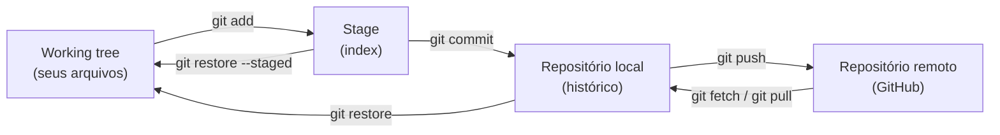
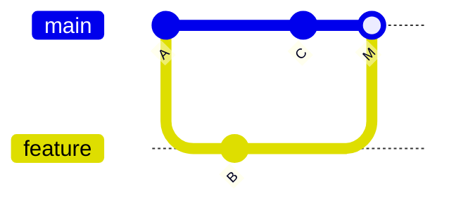
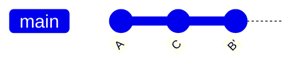

<h1 align="center">
  <a href="https://git-scm.com/">Git</a> e <a href="https://github.com/">GitHub</a>
</h1>

<p align="center">Controle e compartilhe seu código — guia de referência rápida dos comandos mais usados no dia a dia, organizado por tema.</p>

<p align="center">
  <a href="https://github.com/lucasrmagalhaes/git-gitHub/issues">
    
  </a>
  <a href="https://github.com/lucasrmagalhaes/git-gitHub/network/members">
    
  </a>
  <a href="https://github.com/lucasrmagalhaes/git-gitHub/stargazers">
    
  </a>
  <a href="https://github.com/lucasrmagalhaes/git-gitHub/blob/main/LICENSE">
    
  </a>
</p>

## Sumário

- [Como o Git funciona](#como-o-git-funciona)
- [Configuração](#configuração)
- [Criando e clonando repositórios](#criando-e-clonando-repositórios)
- [Staging e commits](#staging-e-commits)
- [Histórico e inspeção](#histórico-e-inspeção)
- [Repositórios remotos](#repositórios-remotos)
- [Branches](#branches)
- [Merge, rebase e cherry-pick](#merge-rebase-e-cherry-pick)
- [Resolvendo conflitos](#resolvendo-conflitos)
- [Desfazendo alterações](#desfazendo-alterações)
- [Stash](#stash)
- [Tags e versões](#tags-e-versões)
- [Fork e Pull Request](#fork-e-pull-request)
- [Comandos avançados](#comandos-avançados)
- [.gitignore](#gitignore)
- [Links úteis](#links-úteis)
- [Licença](#licença)

## Como o Git funciona

Todo comando do Git movimenta seus arquivos entre quatro áreas. Ter esse mapa em mente é o que transforma os comandos decorados em um modelo mental:



Você edita na **working tree**, marca o que vai entrar no próximo commit no **stage**, grava no **repositório local** com o commit e sincroniza com o **remoto** via push/pull.

## Configuração

| Comando | Descrição |
| --- | --- |
| `git config --local user.name "Seu nome"` | Define o nome apenas para o repositório atual. |
| `git config --local user.email "Seu e-mail"` | Define o e-mail apenas para o repositório atual. |
| `git config --global user.name "Seu nome"` | Define o nome globalmente. |
| `git config --global user.email "Seu e-mail"` | Define o e-mail globalmente. |
| `git config --global --list` | Lista as configurações globais. |
| `git config --global core.editor "code --wait"` | Define o Visual Studio Code como editor padrão. |
| `git config --global core.editor "vim"` | Define o Vim como editor padrão. |
| `git config --global --unset core.editor` | Volta para o editor padrão do sistema. |
| `git config --global init.defaultBranch main` | Faz o `git init` criar a branch inicial como `main` em vez de `master` (a partir do Git 2.28). |
| `git config --global core.excludesfile ~/.gitignore_global` | Define um arquivo `.gitignore` global, válido para todos os repositórios da máquina. |
| `git config --global alias.lg "log --graph --oneline --all"` | Cria um atalho (alias): depois basta rodar `git lg`. Funciona para qualquer comando. |

## Criando e clonando repositórios

| Comando | Descrição |
| --- | --- |
| `git init` | Inicializa um repositório Git local. |
| `git init --bare` | Cria um repositório sem working tree (sem cópia dos arquivos). Útil como repositório servidor, para que outros membros da equipe sincronizem seus trabalhos, economizando espaço de armazenamento. |
| `git clone url nome` | Baixa o repositório localmente. O nome é opcional, caso queira uma pasta com nome diferente do original. |
| `git clone -b nome-branch url` | Clona o repositório já em uma branch específica (forma longa: `--branch`). |

## Staging e commits

| Comando | Descrição |
| --- | --- |
| `git status` | Mostra o estado do repositório (arquivos modificados, staged e não rastreados). |
| `git add nome-arquivo` | Adiciona o arquivo ao stage para ser commitado. |
| `git add .` | Adiciona todos os arquivos (novos, modificados e removidos) ao stage, **a partir do diretório atual** e seus subdiretórios. |
| `git add --all` | Adiciona todos os arquivos ao stage **desde a raiz do repositório**, não importando em qual diretório você está. |
| `git mv nome-arquivo novo-nome` | Renomeia (ou move) o arquivo, já registrando a mudança no stage. |
| `git rm nome-arquivo` | Remove o arquivo e registra a remoção no stage. |
| `git commit -m "Mensagem"` | Realiza o commit com título. |
| `git commit -m "Mensagem" -m "Descrição"` | Realiza o commit com título e descrição. |
| `git commit -a -m "Mensagem"` | Adiciona todos os arquivos **já rastreados** que foram modificados e realiza o commit (não inclui arquivos novos). |
| `git commit --amend` | Adiciona as mudanças em stage ao último commit e permite editar a mensagem. |
| `git commit --amend --no-edit` | Adiciona as mudanças em stage ao último commit mantendo a mensagem original. |

## Histórico e inspeção

| Comando | Descrição |
| --- | --- |
| `git log --oneline` | Lista os commits em uma linha cada, de forma mais limpa. |
| `git log -p` | Lista os commits com as alterações (diff) de cada um. |
| `git log --graph --oneline --all` | Mostra o histórico de todas as branches em formato de grafo. |
| `git log --follow nome-arquivo` | Histórico completo do arquivo, mesmo através de renomeações. |
| `git log -S "trecho"` | Busca os commits que adicionaram ou removeram o trecho de código. |
| `git log --help` | Mostra as opções disponíveis do `git log`. |
| `git show nome-hash` | Mostra os detalhes e as alterações de um commit específico. |
| `git blame nome-arquivo` | Mostra quem alterou cada linha do arquivo e em qual commit. |
| `git diff` | Mostra o que foi alterado e ainda não foi adicionado ao stage. |
| `git diff --staged` | Mostra o que está no stage e será incluído no próximo commit. |
| `git diff commit..commit` | Mostra as diferenças entre dois commits. |
| `git reflog` | Lista todos os movimentos do HEAD — ótimo para recuperar commits "perdidos" após reset ou rebase. |
| `gitk` | Abre o visualizador gráfico de histórico. |

> 💡 Para personalizar a saída do log, veja o [git log cheatsheet](https://devhints.io/git-log).

## Repositórios remotos

| Comando | Descrição |
| --- | --- |
| `git remote` | Lista os remotes. |
| `git remote -v` | Lista os remotes com nome e endereço. |
| `git remote add origin https://github.com/usuario/projeto.git` | Adiciona um repositório remoto ao diretório local. |
| `git remote set-url origin https://github.com/usuario/projeto.git` | Altera a URL de um remote já existente. |
| `git remote rename nome-atual novo-nome` | Renomeia o remote. |
| `git remote remove nome-remote` | Remove o remote. |
| `git push nome-remote nome-branch` | Envia os commits para o repositório remoto. Usando `git push -u origin main` uma vez, o vínculo fica salvo e depois basta `git push`. |
| `git push --all` | Envia todas as branches para o repositório remoto. |
| `git push --force-with-lease` | Reenvia histórico reescrito (após rebase ou amend), mas falha se o remoto tiver commits que você ainda não viu. |
| `git fetch` | Baixa as informações do repositório remoto **sem** alterar nenhuma branch local. |
| `git fetch --prune` | Baixa as informações e remove as referências locais de branches já deletadas no remoto. |
| `git pull` | Baixa e incorpora as alterações do remoto na branch local atual. |
| `git pull --rebase` | Baixa as alterações do remoto e reaplica seus commits locais por cima, sem criar merge commit. |

> [!WARNING]
> Nunca use `git push --force` em branches compartilhadas: ele sobrescreve o histórico do remoto mesmo que outra pessoa tenha enviado commits. Prefira sempre `--force-with-lease`.

## Branches

| Comando | Descrição |
| --- | --- |
| `git branch` | Lista as branches locais. |
| `git branch -a` | Lista as branches locais e remotas. |
| `git branch -vv` | Lista as branches locais mostrando o vínculo de cada uma com sua branch remota (upstream). |
| `git branch nome-branch` | Cria uma branch. |
| `git checkout nome-branch` | Muda para a branch. |
| `git switch nome-branch` | Muda para a branch (comando mais novo, equivalente ao checkout). |
| `git checkout -b nome-branch` | Cria a branch e já muda para ela. |
| `git switch -c nome-branch` | Cria a branch e já muda para ela (equivalente moderno). |
| `git checkout -` | Volta para a branch anterior sem precisar digitar o nome. |
| `git branch -m novo-nome` | Renomeia a branch atual. |
| `git branch -m nome-atual novo-nome` | Renomeia outra branch, estando fora dela. |
| `git branch -d nome-branch` | Deleta a branch (somente se já foi mesclada). |
| `git branch -D nome-branch` | Força a exclusão da branch, mesmo sem merge. |
| `git push origin --delete nome-branch` | Deleta a branch no repositório remoto. |

## Merge, rebase e cherry-pick

| Comando | Descrição |
| --- | --- |
| `git merge nome-branch` | Incorpora os commits da branch informada na branch atual, gerando um merge commit quando necessário. |
| `git merge --abort` | Cancela um merge em andamento (com conflitos). |
| `git rebase nome-branch` | Reaplica os commits da branch atual por cima da branch informada. Diferente do merge, não gera merge commit — o histórico fica linear. |
| `git rebase -i HEAD~3` | Modo interativo sobre os últimos 3 commits: `pick` mantém, `reword` edita a mensagem, `squash` combina com o commit anterior, `drop` descarta. |
| `git rebase -i --root` | Modo interativo desde o primeiro commit do repositório. |
| `git cherry-pick nome-hash` | Traz um commit específico de outra branch para a branch atual. |

**Merge** junta as duas linhas de trabalho e registra a junção em um merge commit:



**Rebase** reaplica os commits da sua branch por cima da outra — o histórico fica linear, como se tudo tivesse sido feito em sequência:



> [!WARNING]
> Rebase **reescreve o histórico** (os commits ganham novos hashes). Nunca rebaseie commits que já foram enviados para uma branch compartilhada — use rebase apenas em branches suas, antes do push, e reenvie com `git push --force-with-lease`.

## Resolvendo conflitos

Um conflito acontece quando um `merge`, `rebase` ou `pull` altera as mesmas linhas que você alterou. O Git marca o trecho conflitante no arquivo assim:

```text
<<<<<<< HEAD
versão da sua branch atual
=======
versão da branch que está sendo incorporada
>>>>>>> nome-branch
```

Para resolver:

1. `git status` — lista os arquivos em conflito (*both modified*).
2. Abra cada arquivo, escolha o que fica (pode combinar as duas versões) e **apague os marcadores** `<<<<<<<`, `=======` e `>>>>>>>`.
3. `git add nome-arquivo` — marca o conflito como resolvido.
4. `git merge --continue` (ou `git rebase --continue`) — conclui a operação. Para desistir e voltar ao estado anterior: `git merge --abort` (ou `git rebase --abort`).

| Comando | Descrição |
| --- | --- |
| `git checkout --ours nome-arquivo` | Resolve o arquivo ficando com a versão da sua branch atual. |
| `git checkout --theirs nome-arquivo` | Resolve o arquivo ficando com a versão da outra branch. |
| `git mergetool` | Abre a ferramenta visual de merge configurada. |

> 💡 Durante um **rebase** os papéis se invertem: `--ours` passa a ser a branch sobre a qual você está rebaseando, e `--theirs` a sua branch.

## Desfazendo alterações

Pronto-socorro — procure pela situação:

| Situação | Solução |
| --- | --- |
| Errei a mensagem do último commit | `git commit --amend` |
| Adicionei o arquivo errado ao stage | `git restore --staged nome-arquivo` |
| Quero desfazer o último commit, mantendo as alterações | `git reset --soft HEAD~1` |
| Commitei na branch errada | `git branch branch-certa` → `git reset --hard HEAD~1` → `git switch branch-certa` |
| Já fiz push do commit errado | `git revert nome-hash` (não reescreve o histórico) |
| Perdi um commit depois de um reset | `git reflog` para achar o hash → `git reset --hard nome-hash` |
| Quero descartar tudo que ainda não commitei | `git restore .` |

Referência completa:

| Comando | Descrição |
| --- | --- |
| `git restore nome-arquivo` | Descarta as alterações do arquivo (comando mais novo). |
| `git checkout -- nome-arquivo` | Descarta as alterações do arquivo (forma antiga). |
| `git restore .` | Descarta as alterações de todos os arquivos. |
| `git restore --staged nome-arquivo` | Tira o arquivo do stage, mantendo as alterações (comando mais novo). |
| `git reset HEAD nome-arquivo` | Tira o arquivo do stage, mantendo as alterações (forma antiga). |
| `git reset --soft HEAD~1` | Desfaz o último commit e mantém as mudanças no stage. `HEAD~1` equivale a `HEAD^` — prefira `~1`, que funciona também no cmd do Windows, onde `^` é caractere de escape. |
| `git reset --hard HEAD~1` | Desfaz o último commit e **descarta** as mudanças. |
| `git revert nome-hash` | Cria um novo commit que desfaz as alterações do commit informado — seguro para histórico já publicado. |
| `git clean -n` | Lista os arquivos não rastreados que seriam removidos (simulação). |
| `git clean -dn` | Lista arquivos e diretórios não rastreados que seriam removidos. |
| `git clean -df` | Remove arquivos e diretórios não rastreados. |
| `git rm -r --cached nome-diretorio/` | Remove o arquivo/diretório do controle do Git sem apagá-lo do disco — útil após atualizar o `.gitignore`. |
| `git checkout nome-hash` | "Viaja no tempo" para um commit (detached HEAD). Para salvar alterações a partir dele, crie uma nova branch. |

> [!WARNING]
> `git reset --hard`, `git clean -df` e `git stash clear` descartam trabalho **permanentemente**. Antes de rodar, confira o que será perdido (`git status`, `git clean -n`, `git stash list`). Commits sumidos podem ser recuperados pelo `git reflog` — mas alterações que nunca foram commitadas não têm volta.

## Stash

| Comando | Descrição |
| --- | --- |
| `git stash` | Guarda as modificações atuais para usar depois, limpando a working tree. |
| `git stash push -m "mensagem"` | Guarda as modificações com uma mensagem de contexto (substitui o antigo `git stash save`). |
| `git stash -u` | Guarda também os arquivos não rastreados (novos), que o stash normal deixa para trás. |
| `git stash list` | Lista os stashes salvos. |
| `git stash apply stash@{n}` | Aplica as modificações do stash indicado, mantendo-o na lista. |
| `git stash pop` | Aplica o stash mais recente e o remove da lista. |
| `git stash drop stash@{n}` | Remove o stash indicado da lista. |
| `git stash clear` | Remove todos os stashes. |

> 💡 No PowerShell, `stash@{n}` é interpretado pelo shell e o comando falha — use aspas (`git stash apply "stash@{0}"`) ou apenas o número (`git stash apply 0`).

## Tags e versões

| Comando | Descrição |
| --- | --- |
| `git tag -a v0.1.0 -m "Lançando a primeira versão."` | Cria uma tag anotada — um ponto fixo no histórico que não deve mais ser modificado. |
| `git tag` | Lista as tags. |
| `git push origin v0.1.0` | Envia a tag para o repositório remoto. |
| `git push origin --tags` | Envia todas as tags para o repositório remoto. |

## Fork e Pull Request

O fluxo clássico para contribuir com um projeto no GitHub — do fork ao Pull Request:

```bash
# 1. Faça o fork pelo site do GitHub (botão "Fork") — cria a sua cópia do projeto

# 2. Clone o SEU fork
git clone git@github.com:seu-usuario/projeto.git

# 3. Aponte um remote para o repositório original
git remote add upstream https://github.com/autor-original/projeto.git

# 4. Crie uma branch para a sua contribuição
git switch -c minha-contribuicao

# 5. Faça seus commits e envie para o SEU fork
git push -u origin minha-contribuicao

# 6. Abra o Pull Request pelo site ("Compare & pull request")

# 7. Depois do merge, atualize seu fork com o projeto original
git switch main
git fetch upstream
git merge upstream/main
git push origin main
```

Ao mesclar um Pull Request, o GitHub oferece três estratégias:

| Estratégia | O que faz | Quando usar |
| --- | --- | --- |
| **Merge commit** | Preserva todos os commits do PR e cria um merge commit. | Quando o histórico detalhado da branch importa. |
| **Squash and merge** | Combina todos os commits do PR em um único commit na main. | PRs com muitos commits pequenos; mantém a main limpa. |
| **Rebase and merge** | Reaplica os commits um a um na main, sem merge commit. | Histórico linear, com commits já bem organizados. |

## Comandos avançados

| Comando | Descrição |
| --- | --- |
| `git bisect start`<br>`git bisect good nome-hash`<br>`git bisect bad nome-hash`<br>`git bisect reset` | Encontra o commit que quebrou o projeto por busca binária: você indica um commit bom (`good`) e um ruim (`bad`), o Git faz checkouts intermediários e você vai classificando cada um até ele apontar o commit culpado. |
| `git gc --prune=now` | Otimiza o repositório removendo objetos soltos. Resolve erros como `unable to resolve reference` ou `unable to update local ref` no pull (veja também `git fetch --prune`). |

## .gitignore

O arquivo `.gitignore`, criado na raiz do repositório, define arquivos e diretórios que o Git **não** deve monitorar (dependências, builds, arquivos de ambiente etc.).

```gitignore
node_modules/
dist/
.env
*.log
```

> Se o arquivo já estava sendo rastreado antes de entrar no `.gitignore`, use `git rm -r --cached nome-arquivo` para removê-lo do controle do Git.

## Links úteis

- [Visualizing Git](https://git-school.github.io/visualizing-git/) — simulador visual de comandos Git.
- [Pro Git Book](https://git-scm.com/book/en/v2) — livro oficial, gratuito e completo.
- [GitHub Skills](https://skills.github.com/) — cursos interativos oficiais do GitHub.
- [Conventional Commits](https://www.conventionalcommits.org/en/v1.0.0/) — convenção para mensagens de commit.
- [GitHub Docs — Conectar-se ao GitHub com SSH](https://docs.github.com/pt/authentication/connecting-to-github-with-ssh)
- [git log cheatsheet](https://devhints.io/git-log) — personalização da busca de logs.

## Licença

Este projeto está sob a licença [MIT](LICENSE).
